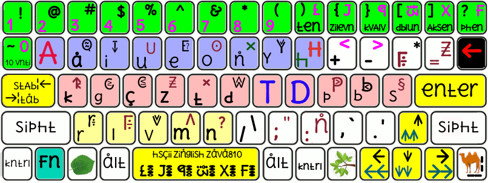
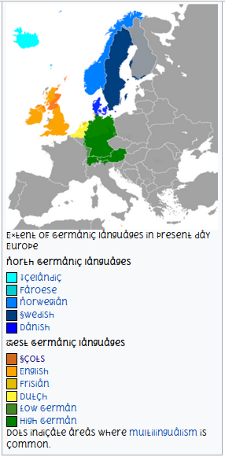
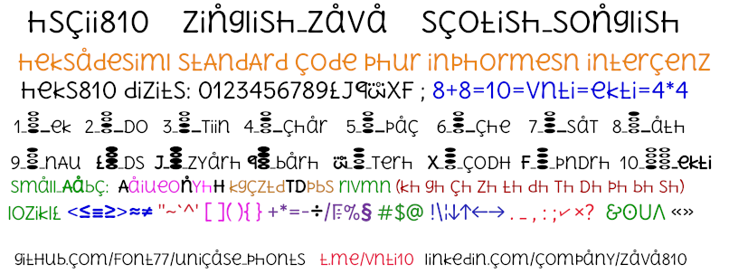
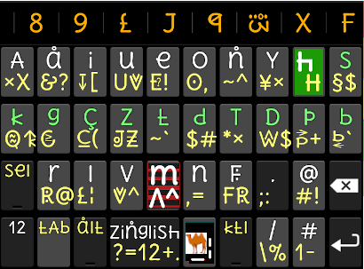
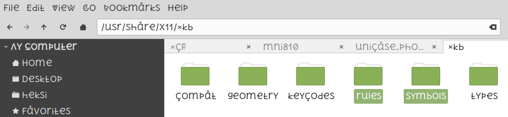

# hscii810 phur digital zinglish zemistry maths & zava 0123456789LJQWXF
##### (heksadesiml stAndArd code phur inphormesn intercenz)
### **[u5cdot phonts instal ke liye vizit kre](./hao_tu_install.md)**
<hr></hr>

(keyboard layout phur hscii810 zava multilanguage mozilla mint linuks )
<hr></hr>
(vest zermanik lANguAzis)


<hr></hr>




<hr></hr>



1. to install keypad in Android <a href="https://github.com/zava810/zava810">vizit</a> & daunload  install
(hpop_u5.apk) & u5c.ttf(using zfont3) in Android.

2.<a href="https://github.com/Font77/unicase_phonts">
click & phollo steps to install/cenz unicase phonts in mozilla/mint_linuks/Android</a>

<hr></hr>
#### hinDi snskriT mrathi guzraTi Devnagri keyboard


(<a href="https://github.com/Font77/unicase_phonts">
vant to try? pliiz install/cenz unicase phonts in mozilla/mint_linuks/Android</a>)
<hr></hr>

```

2 Thumbs sign shou svitch phur oph/on/lock/unlock
8 phingers to type zinglish & compute zava810
8 + 8 = 10 = vnti = 4 * 4
L = ten/Ds , J = zilevn/zyarh , Q = kvAlv/barh ,
W = dblu/Terh , X = Aksen/coDH ,
F = phen/pnDrh = vnti - 1 = 10 - 1 = vnti - vn
= ekti - ek = 10 - 1
```
<a href="https://github.com/zava810/kms/">github/zava810/kms/</a> -> imez/mni810

</img>

## linuks mint me keyboard bDle xkb ke saTh.


linuks mint me is keypad ke liye **<a href="./mintoskeybord">1.zi 2.base.lst 3.evdev.xml</a>** dounload kiziye.

![linuks mint keyboard layout phails][xkblocimz]


1. **zi** ko **/usr/share/X11/xkb/symbols/** mein paste kre. iske liye symbols ko **root access** ke saTh khole.
2. sudo vi /usr/share/X11/xkb/rules/base.lst
3. isko open krke layout search kre Aur **zi** layout ki line add kre.
```
! layout
us              English (US)
zi              zinglishzava810scotlish
```
4. **evdev.xml** ko **/usr/share/X11/xkb/rules/** me paste kre. iske liye ise root access ke saTh khole.
5. setxkbmap command linuks prompt pr try kre.

> $ **setxkbmap zi**

Ab keys (Q A) , (w D) , (T, X) , (F,N) , (X,T) press krke Dekhe. phir se shipht key ke saTh bhi Dekhe.

> $ **setxkbmap us**


Ab keys (Q A) , (w D) , (T, X) , (F,N) , (X,T) press krke Dekhe. phir se shipht key ke saTh bhi Dekhe.

iin 3 phails ko yha se [daunload](../mintoskeybord) kre or sHi se bDle.

to try these in Android/mozilla , kirpya/pliiz :

1. **hksuletr.apk** daunload kre Aur Android mein install kre.
2. **hpop_u5.apk** daunload kre Aur Android mein hpop keypad install kre.
3. **zFont 3** google **play store** se install kre.
4. **u5cdot.ttF** daunload kre Aur Android mein **zFont 3** ke saTh install kre.
5. mozilla me u5cdot install krne ke liye [hao tu](./hao_tu_install.md) prrkr/read kre.

AgAr apko koi **help** cahiye Toh [vk/zs810](vk.com/zs810) pr piNg kiziyega.

1. maths ( 4_fourTh - q_kvAlvTh ) , zemistry ( 9_nineTh - q_kvAlvTh )
2. zinglish seo & marketiNg ( 7Th - J_zilevnTh - bca/mca)
3. zava810/Android rust810 python ( L_tenTh - J_zilevnTh - bca/mca .. )
4. gimp , kdenlive , linuxmint , notepad++ ( 7Th - J_zilevnTh - bca/mca)

pliiz try in your Android / mozilla phayrphoks:

#### hksuletr.apk, hpop_u5.apk u5.ttf (zfont 3 needed)
At: [github/zava810][z8z8] .


### ascii510(5+5=10=?X?) -> ascii810(8+8=10=4X4)  

## steps tu instal **u5c** phont & **hpop kibord** on android mobail
1. daunload & install [roboto510 roboto810 robotobin]
    1. font can be edited using **fontforge** open source softveyr.
    2. hao tu **instal** phont on yuAr mobile **dipAnds** on yuAr mobail **modAl**
    3. yu kn du gugAl src - custom font install android 2019
    4. iph it is xiomi Dn use **miui font installer old** method.
2. hpop instalesAn
    1. aphtr instaling roboto_heks_jk.ttf daunload [hpop.apk][github hpop apk lifk]
    2. Dn opAn **hpop.apk** & **instal** in yuAr Androed mobail.  
